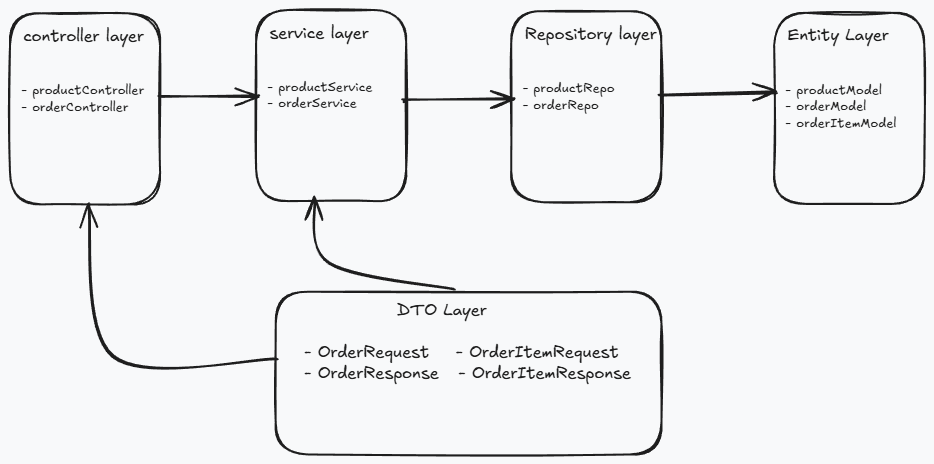
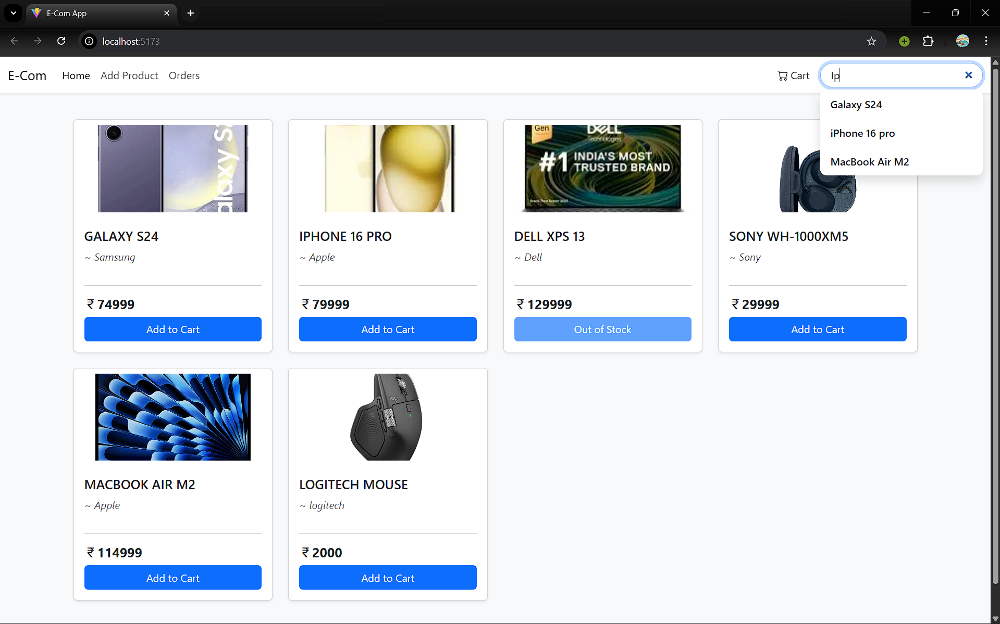
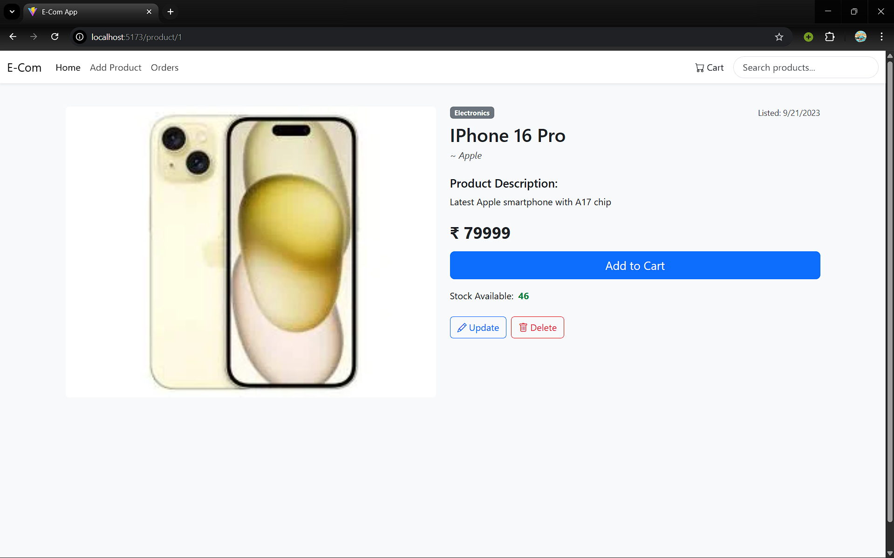
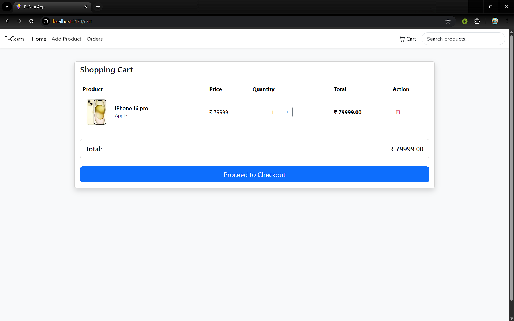
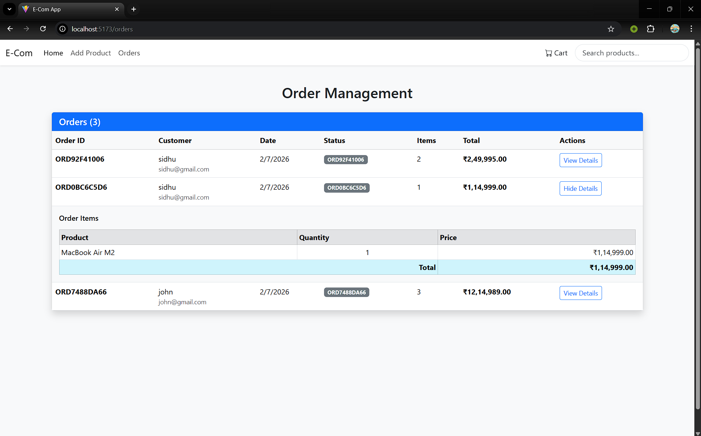

# E-commerce Application

This is a e-commerce application built using Spring Boot, Spring Data JPA, and MySQL. The application allows users to browse products, add them to a shopping cart, and place orders. It also includes an admin panel for managing products and orders.

## Features
- User registration and authentication
- Product browsing and searching
- Shopping cart management
- Order placement and tracking

## Technologies Used
- Spring Boot   
- Spring Data JPA
- postgreSQL
- ReactJS
- Spring Security

